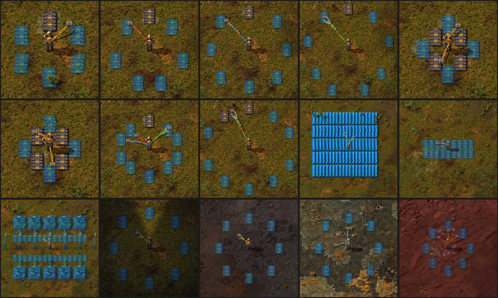

# factorio-mod-constructor-equipment
A mod for the game Factorio, adding equipment for short range automated construction.

## Features

* Four tiers of equipment that use inserter arms to build nearby blueprints from your inventory.
* Four technologies to unlock the equipment.
* Equipment works in a vehicle's equipment grid, building as you drive out of the vehicle's own inventory. Equipment in your armour is idle while you are in a vehicle.
* A vehicle's arms sit along the sides of its hull and reach from where they are mounted.
* A toolbar button switches your own equipment off and on.
* The arms carry out upgrade planner orders, swapping what is standing there and bringing the old one back to you.
* The arms clear what you mark with a deconstruction planner, entities and tiles alike, emptying anything with something in it first.
* A cliff marked for deconstruction is blown up, at the cost of one cliff explosive.
* The arms reach for where a ghost will be by the time the claw gets there, so things go up while you walk or drive past rather than only from a standstill.
* A quality piece of the equipment makes a quality arm, which extends and turns faster and draws more power for it.
* The arms follow the vehicles into whatever equipment categories another mod has put them in, so an overhaul that re-grids the vehicles does not take the arms off them.

## Screenshots

